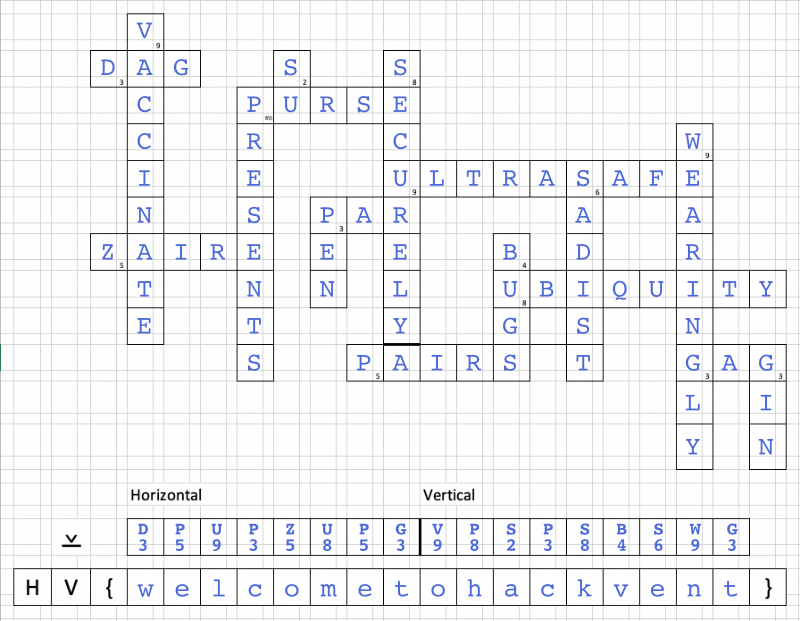

# [HV21.01] X-wORd Puzzle
(Author: `charon`)

The crossword clues weren’t too hard to solve:

**Horizontal**

1.	A diagram of arrows not allowing cycles = **DAG**
2.	A handbag for carrying around money = **PURSE**
3.	Very, very secure = **ULTRASAFE**
4.	Golf: number of strokes required = **PAR**
5.	Congo between 1971 and 1997 = **ZAIRE**
6.	State of appearing everywhere = **UBIQUITY**
7.	Tuples in everyday language = **PAIRS**
8.	Makes you laugh or silences you = **GAG**

**Vertical**

1.	Plea by many doctors right now = **VACCINATE**
2.	Put in parcels = **PRESENTS**
3.	Lets you change user = **SU**
4.	...-test = **PEN**
5.	How you should transmit your data = **SECURELY**
6.	Need to squash them - fix your code! = **BUGS**
7.	Attributed to a marquis - no pain, no gain. = **SADIST**
8.	Doing something in a way that causes fatigue is doing it... = **WEARINGLY**
9.	A drink you may need after finishing this puzzle. = **GIN**

The ⊻ symbol and the challenge name made it abundantly clear that some sort of XOR operation was necessary to obtain the flag. But XORing the first letter of each answer (either its ASCII value or its position in the alphabet) with the clue number and/or the number of letters in each clue didn’t help at all. I finally realised that we were supposed to XOR the first letters with ASCII values corresponding to the number of letters in each answer. For example the answer to the first clue is “DAG”, and if you XOR the ASCII values of “D” and “3” (being the number of letters in this answer), you get “w”. This is the first letter of the flag.

### Flag: `HV{welcometohackvent}`
