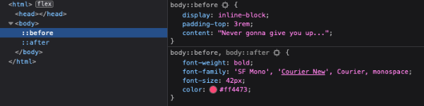
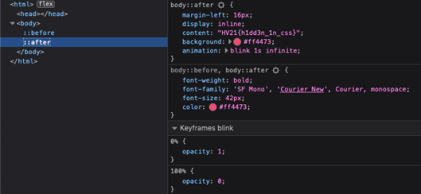

# [HV21.02] No source, No luck!
(Author: `explo1t`)

When you start up and launch the web instance, you get redirected to a YouTube video (that one with Rick Astley in it; I’m sure you’ve seen it before!). It should be easy enough to find out what’s going on by viewing the page source before the redirect happens, but it’s completely empty. What’s going on?? Before you have a chance to find out, the page has already redirected to YouTube and Rick is singing that song again :-(

Fortunately, it’s easy to stop this annoying behaviour. In the `about:config` page, change `accessibility.blockautorefresh` to `false`. That stops the redirect and gives you as much time as you like to look at the source code. Using the browser’s Developer Tools, it’s easy to see what’s going on. The document body is indeed empty, but has `::before` and `::after` rules that add various bits of content, including a flag:

For those that are interested, I found an online video that describes this challenge in more detail: https://www.youtube.com/watch?v=dQw4w9WgXcQ

### Flag: `HV21{h1dd3n_1n_css}`
