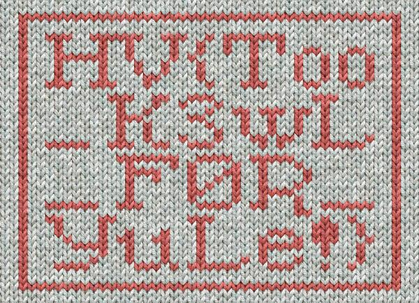

# [HV21.05] X-Mas Jumper
(Author: `monkey`) &larr; me! 😁

It looks like the elves forgot to resize the image properly when they scaled up the design to fit Santa's XXL dimensions. If the number of stitches per row is changed from 48 to 37 per row, the answer can clearly be seen:

```plaintext
------------- 48 stitches per row: -------------
XXX..XXXXXX..XXX..X.XXXXXXX...........X....X..X.
...X..X..X..X..X...........X....X..X....X..X..X.
.X..X..XX...XX..XXXXXX..X....X.X......X....X..X.
X..X.X....X...X..X...X.....X....X..X.X..X.X....X
...X..X...X.....X....X..X.X..X.X....X....XX....X
.....X....X..X.X..XXXX..XXX...X......X...XXX....
XX...XX.........................................
....XXX..XX..XXX...........XXX............X...X.
.X...X...........X.............X..X......X..XX.X
XX.XX.X.............XXX.....XX....X..X..X..X....
.........X..X......X...X..X..X..X.............X.
.X.......X..X..X..X..X.............X..X...X...X.
..XX.XX...X....XXXXXX..XXX..XX..XXX.....X.X...XX
XXXX............................................
..XXXXXXX..XXXX..XXXXX..................X....X.X
....X..X...X.................XXXX...X...XX..X...
.X................X..X...X..X.X..X....X.........
.......X......X.X..X..X...X.................X...
...XX...X..XXXX..................X......X....X..
X...X........XXXXXX..XXX......XXXX..XX...X..XXXX
XX............................XX.......XX....XX.
.......XXX............X..X...X....X..........X..
..........XXX..X..X....X..X...X...X.......XXX..X
XX..X...X...X.XX..XX...X......X...X.XXX...X...XX
XX..X...X...X......XXXXX..X...X.......X..X...X..
.X......X......X...X......X...X...X...X....X.X..
.X......X..XXXX.....XXX.X.XXXXXX...XXX...X..X...
```

```plaintext
------ Rewrapped @ 37 per row: ------
XXX..XXXXXX..XXX..X.XXXXXXX..........
.X....X..X....X..X..X..X..X..........
.X....X..X....X..X..X..X..X..XX...XX.
.XXXXXX..X....X.X......X....X..X.X..X
.X....X...X..X...X.....X....X..X.X..X
.X....X...X..X...X.....X....X..X.X..X
.X....X....XX....X.....X....X..X.X..X
XXX..XXX...X......X...XXX....XX...XX.
.....................................
.......XXX..XX..XXX...........XXX....
........X...X..X...X...........X.....
........X..X......X..XX.XXX.XX.X.....
........XXX.....XX....X..X..X..X.....
........X..X......X...X..X..X..X.....
........X..X.......X..X..X..X..X.....
........X..X...X...X...XX.XX...X....X
XXXXX..XXX..XX..XXX.....X.X...XXXXXX.
.....................................
........XXXXXXX..XXXX..XXXXX.........
.........X....X.X....X..X...X........
.........XXXX...X...XX..X....X.......
.........X..X...X..X.X..X....X.......
.........X......X.X..X..X...X........
.........X......XX...X..XXXX.........
.........X......X....X..X...X........
XXXXXX..XXX......XXXX..XX...X..XXXXXX
............................XX.......
XX....XX........XXX............X..X..
.X....X..........X............XXX..X.
.X....X..X...X...X.......XXX..XXX..X.
..X...X.XX..XX...X......X...X.XXX...X
...XXXX..X...X...X......XXXXX..X...X.
......X..X...X...X......X......X...X.
.....X...X...X...X....X.X...X......X.
.XXXX.....XXX.X.XXXXXX...XXX...X..X..
```

It’s what all the best dressed elves are wearing this season!



### Flag: `HV{Too_K3WL_F0R_YuLe!}`
