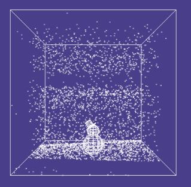
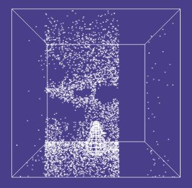
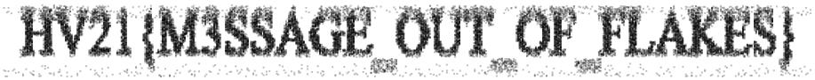

# [HV21.06] Snow Cube
(Author: `Dr Nick`)

This was a very creative challenge. The falling snowflakes spell out the characters of the flag, but only when viewed from the side. In the default front view, they look more or less random, and it’s impossible to discern anything meaningful. But a quick inspection of the source code shows that this can be fixed by typing in `alpha = Math.PI / 2` at the JavaScript console.

|  |  |
| :---: | :---: |
| Front view | Side view |


Once that’s done, it’s easy enough to jot down each character of the flag as it scrolls past. With a bit of modification to the source code, it’s also possible to display the entire flag in one image. This is what I ended up with:

```html
<!DOCTYPE html>
<html lang="en">
  <body style="background: #fff">
        <canvas width="910" height="100" id="scan"></canvas>
    <script>
      const canvas = document.getElementById("scan");
      const context = canvas.getContext("2d");
      let b = 800;

      snowCube = [[800,800,800],[800,800,-800],...,[0,520,-133]];
      snowFlakes = [[670,-287,781,2.01],...,[-626,-20682,618,3.24]];
      let snowman = snowCube.length;

      for (let i = 0; i < snowFlakes.length; i++) {
        snowCube[snowCube.length] = [snowFlakes[i][0],snowFlakes[i][1],snowFlakes[i][2]];
      }

      context.fillStyle = "rgba(0,0,0,0.25)";
      let px = 0;

      while (px < canvas.width) {
        for (let i = snowman; i < snowCube.length; i++) {
          if (snowCube[i][1] < b*2) {
              oy = snowCube[i][1];
            snowCube[i][1] += snowFlakes[i - snowman][3] * 10;
            ny = snowCube[i][1];
            if (ny>=0 && oy<0 && px<canvas.width) {
                sy = 53 - snowCube[i][2] / 20;
                context.fillRect(px-1, sy, 2, 2);
            }
          }
          px+=0.00006;
        }
      }
    </script>
  </body>
</html>
```

And here’s the result:



### Flag: `HV21{M3SSAGE_OUT_OF_FLAKES}`
