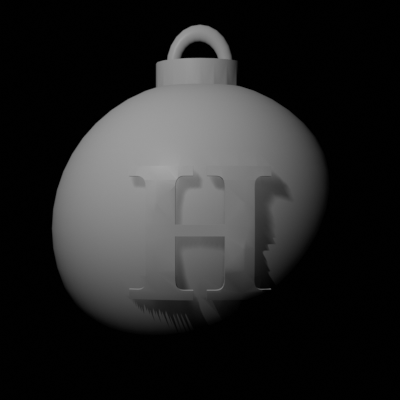
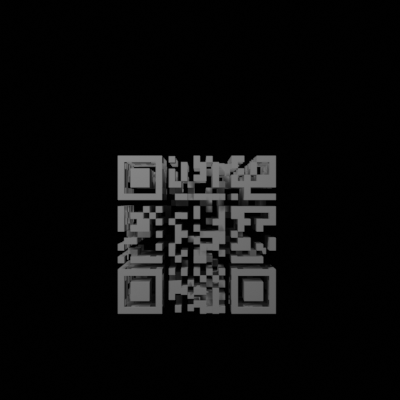

# [HV21.15] Christmas Bauble
(Author: `Dr Nick`)

This one was easy. STL files are used to store 3D objects. [Blender](https://www.blender.org/) can open them no problem. This one contains a bauble. If you delete all the outside parts (enter edit mode, select a vertex, select connected vertices, press X to delete), then you get something that looks very much like a QR code. If you switch to an orthographic (i.e., non-perspective) camera and change the colours to get a matt black object on a white background, then you can scan the QR code directly from the screen. Rotate by 90° about the vertical axis to get another QR code, and by 90° about the horizontal axis to get a third. These give you three pieces of text that join to form the flag

|  | It's a bauble |
| --- | --- |
|  | With this inside! |
|  | `th3_fl4g_with_the_2nd` |
|  | `P4rt_c0mb1ned_w17th_th4t}` |
|  | `HV21{1st_P4rt_0f_` |

### Flag: `HV21{1st_P4rt_0f_th3_fl4g_with_the_2nd_P4rt_c0mb1ned_w17h_th4t}`

**Note:** There was also a [hidden flag](HV21-Hidden_Where_did_you_find_that) in this 3D model.
