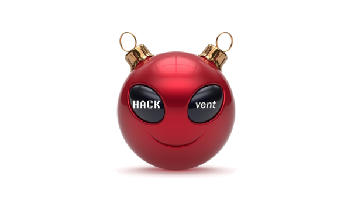

# HACKvent 2021 Writeup

As usual, [Hacking Lab](https://hacking-lab.com/) ran its annual [HACKvent CTF contest](https://competition.hacking-lab.com/) during December 2021. And as usual, I was nowhere near the top ten solvers (37th this year). I did, however, create a couple of this year's challenges.

These are the ones I solved (\* I created these):

- [[HV21.01] X-wORd Puzzle](HV21.01_X-wORd_Puzzle.md)
- [[HV21.02] No source, No luck!](HV21.02_No_Source_No_Luck.md)
- [[HV21.03] Too Much GlItTer!](HV21.03_Too_Much_GlItTer.md)
- [[HV21.05] X-Mas Jumper](HV21.05_X-Mas_Jumper.md) \*
- [[HV21.06] Snow Cube](HV21.06_Snow_Cube.md)
- [[HV21.08] Flag Service](HV21.08_Flag_Service.md)
- [[HV21.09] Brother Santa](HV21.09_Brother_Santa.md)
- [[HV21.12] Santa’s Shuffle](HV21.12_Santas_Shuffle.md)
- [[HV21.15] Christmas Bauble](HV21.15_Christmas_Bauble.md)
- [[HV21-Hidden] Where did you find that??](HV21-Hidden_Where_did_you_find_that.md)
- [[HV21.18] Lost Password](HV21.18_Lost_Password.md) \*

I also made a [PDF file containing all of the above writeups](writeup.pdf).
